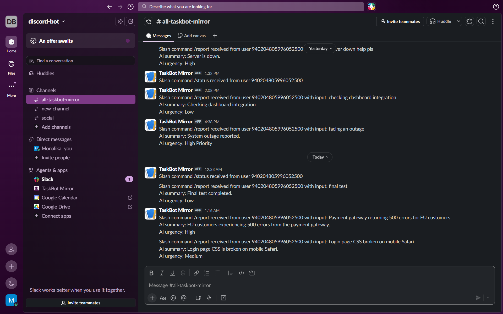

# Discord Slash-Command Bot

A full-stack Discord bot with slash commands, AI-powered report tagging, slack mirroring, and an admin dashboard for logs configuration, and error observability.

## What it does

- Two slash commands: `/report <text>` and `/status`
- Verifies every incoming Discord interaction using Ed25519 signature verification
- Logs every command to MongoDB, deduped by Discord's interaction ID
- For `/report`: uses Google Gemini to summarize the report and assign an urgency tag, with admin-configurable keyword rules that can override the AI's tag
- Mirrors every command to a Slack channel via an Incoming Webhook
- Responds in Discord using a deferred acknowledgment + follow-up message, to stay within Discord's response time limits even when downstream calls (Slack, Gemini) are slow
- Admin dashboard (behind login) showing: a live-updating command log, editable keyword→tag rules, and a history of downstream failures

## Tech stack

Node.js, Express, MongoDB (Mongoose) via MongoDB Atlas, discord-interactions (signature verification), express-session (admin auth), Google Gemini API (AI tagging), Slack Incoming Webhooks, EJS (dashboard views), deployed on Render.

## Running locally

```bash
git clone https://github.com/MonalikaDoda/discord-bot.git
cd discord-bot
npm install
cp .env.example .env
# fill in .env with your own values — see Environment Variables below
node src/index.js
```

Note: the Discord interactions endpoint (`/interactions`) requires a publicly reachable HTTPS URL — Discord cannot deliver interactions to `localhost`. For local testing, use a tunnel (e.g. `ngrok http 3000`) and set that tunnel URL as your Interactions Endpoint URL in the Discord Developer Portal.

This project was developed and deployed iteratively with services already provisioned; a fresh from-scratch local setup mirrors the steps below but hasn't been separately re-verified end-to-end.

## Environment variables

| Variable | Description | Where to get it |
|---|---|---|
| `DISCORD_PUBLIC_KEY` | App's public key | Discord Developer Portal → General Information |
| `DISCORD_BOT_TOKEN` | Bot token | Discord Developer Portal → Bot |
| `DISCORD_APP_ID` | Application ID | Discord Developer Portal → General Information |
| `MONGODB_URL` | Database connection string | MongoDB Atlas → free M0 cluster → Connect → Drivers |
| `SLACK_WEBHOOK_URL` | Mirror channel webhook | Slack app → Incoming Webhooks |
| `GEMINI_API_KEY` | AI tagging | Google AI Studio → Get API key |
| `ADMIN_USERNAME` | Dashboard login | Set your own value |
| `ADMIN_PASSWORD` | Dashboard login | Set your own value |
| `SESSION_SECRET` | Signs session cookies | Any random string |
| `PORT` | Local server port | Optional, defaults to 3000 |

All the above services (Discord, MongoDB Atlas, Google AI Studio, Slack) have free tiers requiring no credit card.

## Deployment

- **Web service:** Render (free tier), auto-deploys on push to `main`
- **Database:** MongoDB Atlas (free M0 cluster)
- Environment variables are set in Render's dashboard, not committed to the repo
- Note: Render's free tier spins down after ~15 minutes of inactivity, which can delay the first request after idle. A keep-alive ping (e.g. via cron-job.org) mitigates this.

## Testing this project

1. **Deployed URL:** `https://discord-bot-4ern.onrender.com`
2. **Join the test Discord server:** `https://discord.com/invite/vTpVnCQp9C`
3. Run `/status` or `/report <some text>` in that server, and watch 
   for the bot's reply
4. **Admin dashboard:** `https://discord-bot-4ern.onrender.com/login`
   - Username: `ctcadmin`
   - Password: `ctcadmin123`
5. **Slack mirror:** every command is also mirrored to a Slack channel.
   - Join here: `https://join.slack.com/t/taskbotmirror/shared_invite/zt-4319otbwk-FZ1WXDvvKyv4uikKVsUTTg`
   - Screenshot for reference:
   
   

## Registering slash commands

Slash commands are registered once via a standalone script, not part of the running server:
```bash
node src/registerCommands.js
```

## AI usage

See `AI_NOTES.md` for how AI tools were used throughout this project, and `.github/copilot-instructions.md` for the context file used with GitHub Copilot.